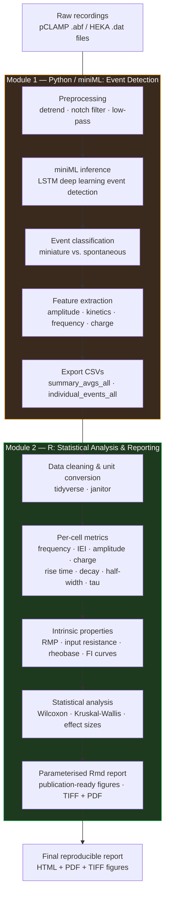

<span class="badge-wip">🔬 Work in Progress</span>

# Automated Electrophysiology Analysis Pipeline for Synaptic Data

**Stack**: Python (miniML · TensorFlow · pandas · h5py) · R (tidyverse · ggplot2 · patchwork · ggdist) · pCLAMP · HEKA · Git

---

## Problem

Manual analysis of whole-cell patch-clamp recordings — miniature and spontaneous postsynaptic currents (mIPSCs/mEPSCs/sIPSCs), FI curves, and intrinsic membrane properties — is a major bottleneck in electrophysiology workflows. A single experiment day can generate dozens of recordings requiring hours of operator-driven threshold adjustment, event detection, and statistical summarisation.

Beyond throughput, manual detection introduces **operator-dependent variability**: different threshold criteria applied to the same recordings produce systematically inconsistent amplitude and frequency estimates, compromising reproducibility and cross-study comparisons. This is a recognised problem in the field that deep learning approaches are only beginning to address.

---

## Solution

An end-to-end automated pipeline in two sequential modules: event detection in Python, followed by statistical analysis and reporting in R.

---

### Module 1 — Python / miniML: Event Detection (Complete)

Classical threshold-based event detection is sensitive to noise, baseline drift, and operator subjectivity. **miniML** (O'Neill et al., 2025) replaces this with a pre-trained deep learning model (LSTM) that detects and classifies miniature synaptic events directly from raw traces, with superior performance in low signal-to-noise conditions.

The batch processing workflow loads all recordings from an experiment folder, applies standardised preprocessing, runs miniML inference on each file, and exports per-cell summary CSVs ready for downstream R analysis.

**Batch processing workflow:**

```python
# --- Core imports ---
import sys
import tensorflow as tf
from pathlib import Path
sys.path.append('core/')
from miniML import MiniTrace, EventDetection
from miniML_plot_functions import miniML_plots
import pandas as pd
import numpy as np
import h5py

# --- Load pre-trained model ---
miniml_model = tf.keras.models.load_model('models/GC_lstm_model.h5')

# --- Preprocessing configuration ---
FILTER_CFG = dict(
    detrend_type='linear',   # remove slow baseline drift
    line_freq=50.0,          # notch filter at 50 Hz (EU mains)
    width=2.0,               # notch filter width (Hz)
    lowpass=1000.0,          # Butterworth low-pass at 1 kHz
    order=4
)

# --- Event detection configuration ---
DETECTION_CFG = dict(
    model_threshold=0.7,     # confidence threshold for event acceptance
    window_size=600,         # analysis window (samples)
    batch_size=512,          # batch size for GPU inference
    event_direction='negative'  # for IPSCs; use 'positive' for EPSCs
)

# --- Batch loop over all recordings in a folder ---
results = []
for dat_file in sorted(raw_data_folder.glob('*.dat')):
    trace = MiniTrace.from_file(
        str(dat_file),
        scaling=1e12,        # convert A to pA
        unit='pA'
    )
    trace.filter_trace(**FILTER_CFG)

    detection = EventDetection(
        data=trace,
        model=miniml_model,
        **DETECTION_CFG
    )
    detection.detect_events(
        eval=True,
        peak_w=5,
        rel_prom_cutoff=0.25,
        convolve_win=20,
        gradient_convolve_win=40
    )

    # Collect per-cell summary statistics
    stats = detection.event_stats
    results.append({
        'file': dat_file.stem,
        'n_events': stats.n_events,
        'frequency_hz': stats.frequency,
        'amplitude_mean_pA': stats.amplitude.mean,
        'amplitude_median_pA': stats.amplitude.median,
        'charge_mean_pC': stats.charge.mean,
        'risetime_mean_ms': stats.risetime.mean * 1000,
        'decaytime_mean_ms': stats.decaytime.mean * 1000,
        'halfwidth_mean_ms': stats.halfwidth.mean * 1000,
        'tau_ms': stats.tau.mean * 1000
    })

# Export to CSV for downstream R analysis
df = pd.DataFrame(results)
df.to_csv(results_folder / 'summary_avgs_all.csv', index=False)
```

The CSV output from miniML feeds directly into the R module, creating a unified analysis chain from raw recording to final statistical report.

---

### Module 2 — R: Statistical Analysis & Reporting (Complete)

Parameterised RMarkdown-based pipeline for statistical analysis and reporting of the miniML output. Designed to be re-run on any new dataset by updating a single configuration block — no code modification required.

**Synaptic event analysis:**
- Import and cleaning of miniML output CSVs (per-cell averages and individual events)
- Per-cell metrics: event frequency, inter-event interval (IEI), amplitude (mean and median), charge, rise time, decay time, half-width, decay tau
- Group-level statistics: Wilcoxon rank-sum / Mann-Whitney U tests, effect sizes, summary tables
- Visualisation: raincloud plots (ggdist), cumulative probability distributions, amplitude histograms, violin + jitter overlays

**Intrinsic membrane property analysis:**
- Input resistance from I-clamp step protocols
- Resting membrane potential (RMP) extraction
- Rheobase estimation from threshold current steps
- FI curve fitting: linear and sigmoid models for gain and rheobase
- E/I balance index from spontaneous event rates

**Output:** Parameterised HTML/PDF reports with publication-ready figures (TIFF + PDF), reproducible across experiments and operators.

---

## Pipeline Architecture



---

## Result

**Up to 90% reduction in electrophysiology processing time** compared to fully manual workflows. miniML eliminates manual event detection — the most time-consuming and operator-variable step; the R module eliminates manual figure generation and statistical reporting.

---

## Current Status

| Module | Status |
|---|---|
| Python — HEKA/pCLAMP file loading & preprocessing | Complete |
| Python — miniML batch event detection | Complete |
| R — mIPSC/mEPSC/sIPSC statistical analysis | Complete |
| R — FI curves & intrinsic properties reporting | Complete |
| R — Parameterised Rmd report templates | Complete |
| Python to R unified output pipeline | In development |
| Public repository & full documentation | Planned Q2 2026 |

---

## Compatibility

**Recording formats:** HEKA `.dat` (via h5py), Axon `.abf` (pCLAMP compatible)

**Event types:** mIPSCs, mEPSCs, sIPSCs, sEPSCs (configurable direction and model)

**Cell types:** The pipeline is generic — not tied to any specific cell type or brain region. miniML models are available for granule cells, CA1 pyramidal neurons, and others; custom model training is supported.

**Operating system:** Linux / macOS / Windows (Python); Linux / macOS preferred for R batch processing

---

## Reference

O'Neill P.S., Baccino-Calace M., Rupprecht P., Lee S., Hao Y.A., Lin M.Z., Friedrich R.W., Müller M., and Delvendahl I. (2025). **A deep learning framework for automated and generalized synaptic event analysis.** *eLife* 13:RP98485. [doi:10.7554/eLife.98485](https://doi.org/10.7554/eLife.98485)

miniML repository: [github.com/delvendahl/miniML](https://github.com/delvendahl/miniML)

---

[Back to Projects](/#projects)
