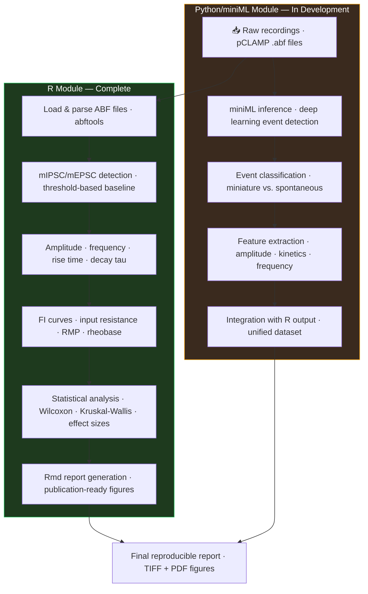

Work in Progress

# Automated Electrophysiology Analysis Pipeline for Synaptic Data

**Stack**: R (in-house Rmd scripts) · Python · miniML (deep learning event detection) · pCLAMP · Git

---

## Problem

Manual analysis of whole-cell patch-clamp recordings (mIPSCs, mEPSCs, FI curves) required days of processing per dataset, with high operator variability and limited reproducibility. Each researcher applying different threshold criteria to the same recordings introduced systematic inconsistency in downstream statistical comparisons.

## Solution

Developing an automated pipeline for electrophysiological data analysis integrating:

- **R-based analysis of mIPSC/mEPSC recordings** (amplitude, frequency, kinetics) — based on in-house patch-clamp datasets from IBiS (Instituto de Biomedicina de Sevilla). Covers inter-event intervals, cumulative probability distributions, and statistical comparisons across conditions.
- **Integration with miniML** (Delvendahl et al.) for ML-based synaptic event detection — a deep learning framework for automated miniature event classification that replaces manual threshold-based detection.
- **Rmd-based reproducible reporting** for FI curves and intrinsic membrane properties (input resistance, resting membrane potential, rheobase, E/I balance). Each report is parameterized so it can be re-run on new datasets without code modification.

## Result

**90% reduction in electrophysiology processing time** (IBiS, Seville). R analysis modules are complete and deployed. Python/miniML integration is in active development, with full pipeline release planned for Q2 2026.

---

## Pipeline Architecture

---

## Technical Details

### R Module (Complete)

- ABF file parsing via `abftools` / custom loaders
- mIPSC/mEPSC analysis: inter-event interval distributions, cumulative probability plots, amplitude histograms
- FI curve fitting: linear and sigmoid models for gain and rheobase estimation
- Intrinsic property extraction: input resistance (I-clamp steps), RMP, action potential threshold
- E/I balance index calculated per cell from spontaneous event rates
- Parameterized RMarkdown templates: one config file per experiment, reports auto-generated

### Python/miniML Integration (In Development)

miniML (Delvendahl et al., 2024) provides a pre-trained deep learning model for automated detection and classification of miniature synaptic events in patch-clamp recordings, outperforming classical threshold-based approaches especially in low SNR conditions.

**Reference**: Delvendahl et al. miniML — automated detection of miniature synaptic events.
- GitHub: [https://github.com/delvendahl/miniML](https://github.com/delvendahl/miniML)
- Publication: [doi:10.7554/eLife.98485.3](https://doi.org/10.7554/eLife.98485.3)

---

## Current Status

| Module | Status |
|---|---|
| R mIPSC/mEPSC analysis scripts | Complete |
| R FI curve & intrinsic properties reporting | Complete |
| Rmd parameterized report templates | Complete |
| Python miniML integration | In development |
| Unified R + Python output pipeline | Planned Q2 2026 |
| Public repository & documentation | Planned Q2 2026 |

---

## Experimental Context

Pipeline developed from in-house whole-cell patch-clamp recordings at **IBiS (Instituto de Biomedicina de Sevilla)**, Fernández-Chacón lab. Recordings include:
- Hippocampal and cortical neurons (mouse, acute slices and primary cultures)
- Voltage-clamp: spontaneous and miniature IPSCs and EPSCs
- Current-clamp: FI curves, RMP, input resistance, action potential properties
- Conditions: WT vs. transgenic CLN4 (DNAJC5) and synaptic mutant models

---

[← Back to Projects](/#projects)
