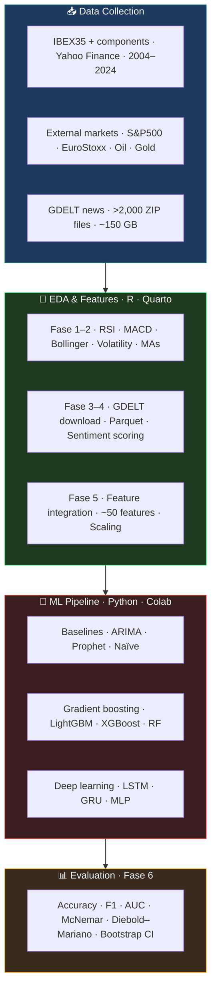

# ML Pipeline for Financial Time-Series: Rigorous Validation Framework

**Tech stack**: Python · R · Quarto · LightGBM · XGBoost · TensorFlow/Keras · scikit-learn · GDELT · quantmod · reticulate
**Repository**: [github.com/SLopezBegines/series_temporales_IBEX](https://github.com/SLopezBegines/series_temporales_IBEX)
**Thesis**: [TFM_Santiago_Lopez_Begines.pdf](https://github.com/SLopezBegines/series_temporales_IBEX/raw/main/TFM_Santiago_Lopez_Begines.pdf)

> **A case study in avoiding false discovery in predictive modeling** — methodology transferable to any high-dimensional time-series problem in biomedical or financial domains. The same statistical framework (McNemar, Diebold-Mariano, bootstrap CIs) applies directly to clinical biomarker validation, EEG classifier evaluation, or omics-based predictive models.

---

## Problem

Evaluating genuine predictive signal in ML models for IBEX35 closing prices, controlling for multiple comparison bias across 336 model/horizon combinations. The canonical problem in ML-driven predictive modeling: how do you distinguish genuine signal from chance performance when testing many models on the same data?

This is especially relevant in biomedical contexts — omics biomarker panels, EEG classifiers, and clinical prediction models all face the same multiple testing challenge.

## Solution

End-to-end pipeline for predicting the **daily directional movement** (up/down) of the Spanish IBEX35 index over a 20-year horizon (2004–2024). The project assesses whether integrating **news sentiment extracted from >2,000 GDELT batches** (~150 GB raw data) improves directional forecasting beyond models trained on price-based technical indicators alone.

Two specific challenges drove the pipeline design:

- **Lookahead contamination** — Strict temporal train/test splits and rolling-window validation prevent any future information from leaking into training, a common flaw in published ML studies.
- **Multiple comparison control** — McNemar test (classification) and Diebold-Mariano test (forecasts), with bootstrap confidence intervals (n=1,000), applied across all 336 model/horizon combinations.

## Result

**Only 27% of models showed genuine predictive value** — confirming that naive model selection without rigorous statistical testing would have produced false positives 73% of the time.

- LightGBM achieves **55–62% directional accuracy** — significantly above the 50% random baseline
- Sentiment adds marginal, inconsistent improvement (<2 pp); technical indicators dominate feature importance
- Deep learning (LSTM, GRU) offers no clear advantage over traditional gradient boosting
- Documented negative result — reproducible pipeline available in repository

---

## Analytical Workflow

## Key Results

| Model | Directional Accuracy | ROC-AUC | Note |
|---|---|---|---|
| **LightGBM** | **55–62%** | **0.58–0.64** | Best overall |
| XGBoost | 53–59% | 0.55–0.61 | |
| Random Forest | 52–57% | 0.54–0.60 | |
| LSTM / GRU | 51–56% | 0.52–0.58 | No DL advantage |
| ARIMA / Prophet | 50–52% | 0.50–0.53 | |
| Naïve baseline | ~50% | ~0.50 | Random walk |

- **Sentiment impact**: GDELT tone improved accuracy by <2 pp in most conditions. McNemar tests (p > 0.05) confirm the improvement is not statistically significant.
- **Top features**: RSI, short-term moving averages, lagged daily returns, intraday range.
- **Efficient market alignment**: results are consistent with the semi-strong form of the EMH — public news sentiment is already priced in within the same trading session.

## Pipeline Structure

**EDA & Feature Engineering (R, 6 Quarto phases)**
Fase 1–2 build the financial feature matrix: technical indicators (RSI, MACD, Bollinger Bands, 10+ moving averages), external market variables, and lagged returns. Fase 3–4 download, filter, and aggregate the GDELT corpus — the most computationally intensive step (~12–24 h, parallelised over >2,000 ZIP archives). Fase 5 merges both feature sets, applies temporal scaling, and verifies consistency before handoff to Python.

**ML Pipeline (Python, Google Colab)**
A single notebook (`pipeline_ML_ibex35.ipynb`) runs the complete training, hyperparameter optimisation, and evaluation loop. All modules are factored into reusable scripts under `ML_Colab/scripts/` so individual components can be run independently. The pipeline auto-detects whether it runs locally, on Colab, or on Kaggle and adjusts paths accordingly.

## Key Technical Details

- 25 modular R scripts organised by pipeline stage (00–25), each with a single functional responsibility
- Parallel GDELT download via `parallel::mclapply` over >2,000 ZIP files; Parquet format for efficient batch I/O
- Python–R bridge via `reticulate` for seamless object transfer between stages
- Time-series cross-validation with strict temporal splits to prevent lookahead bias
- Statistical comparison: McNemar test (classification) and Diebold-Mariano test (forecasts), bootstrap confidence intervals (n=1,000)
- Google Colab integration with auto-path configuration for GPU-accelerated training

> Santiago López Begines, PhD. *Predicción de valores y tendencias de cierre del IBEX35 mediante machine learning y webscraping.* Master's Thesis, Data Science, UNED (2025).

---

[← Back to Projects](/#projects)
