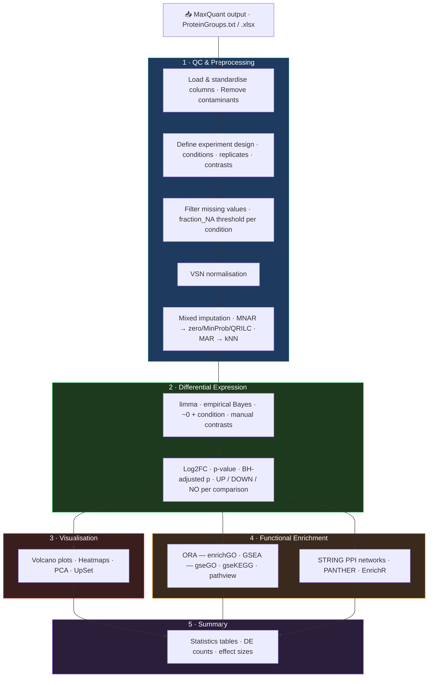

# Automated Proteomics Pipeline for Neurodegeneration Biomarker Discovery

**Stack**: R · DEP · limma · tidyverse · ggplot2 · MaxQuant · Python · Git
**Repository**: [github.com/SLopezBegines/Proteomics](https://github.com/SLopezBegines/Proteomics)

---

## Problem

Large-scale proteomics datasets from neurodegeneration studies required extensive manual curation before statistical analysis, creating bottlenecks and reproducibility risks. Processing a single dataset could take days of repetitive cleaning and validation work.

## Solution

Built an automated R pipeline for MaxQuant label-free quantification output — covering data cleaning, normalization (VSN), differential expression (DEP/limma), and visualization. Integrated cross-validation frameworks for ML-based biomarker discovery. Each analysis is configured through a single RMarkdown file; modular scripts are reused without modification across datasets.

## Result

**70% reduction in data cleaning time.** Pipeline deployed at LCSB (University of Luxembourg) across multiple neurodegeneration datasets. Contributed to peer-reviewed publications in high-impact journals.

---

## Overview

A modular and reproducible R pipeline for analyzing label-free quantitative (LFQ) proteomics data from Orbitrap and Q-Exactive mass spectrometers. The pipeline processes MaxQuant output through a complete analytical workflow: data cleaning, mixed imputation, differential expression analysis, and multi-layered functional enrichment.

Each analysis is configured through a single RMarkdown file that defines organism parameters and experimental design, then calls reusable modular scripts. This architecture allows rapid deployment on new datasets without code modification.

## Technical Approach

Proteomics experiments generate complex datasets with systematic missing values, batch effects, and thousands of protein measurements across conditions. Standard tools handle individual steps but lack integration. This pipeline addresses:

- **Missing value heterogeneity** — Implements a mixed imputation strategy that distinguishes MNAR (below detection limit) from MAR (randomly absent) proteins, applying appropriate methods for each type.
- **Reproducibility** — Modular scripts with centralized parameter control ensure consistent processing across datasets.
- **Multi-organism support** — Configurable for human, mouse, and zebrafish without pipeline modification.

## Analytical Workflow

## Key Technical Details

- Differential expression via `DEP::analyze_dep()` wrapping limma with flexible manual contrasts
- Configurable imputation: `fraction_NA`, `factor_SD_impute`, and MNAR method selection
- Automated directory structure and sequential figure numbering for reproducible outputs
- Dual export (TIFF raster + PDF vector) for all figures
- Gene identifier mapping through biomaRt and AnnotationDbi (UNIPROT → ENSEMBL/ENTREZ)

## Example Application — CLN3 Lysosomal Interactome

The repository includes a complete analysis of the **CLN3 lysosomal interactome** in human cell lines (ProteomeXchange [PXD031582](https://www.ebi.ac.uk/pride/archive/projects/PXD031582)), comparing CTRL vs WT vs KO conditions across 12 samples and 3 pairwise contrasts.

> Calcagni' et al. *Loss of the batten disease protein CLN3 leads to mis-trafficking of M6PR and defective autophagic-lysosomal reformation.* Nat Commun 14, 3911 (2023). [doi:10.1038/s41467-023-39643-7](https://doi.org/10.1038/s41467-023-39643-7)

---

## Output Gallery

### Quality Control & Normalisation

  <figure>
    
    <figcaption>QC overview — protein identification and coverage</figcaption>
  </figure>
  <figure>
    
    <figcaption>VSN normalisation diagnostics</figcaption>
  </figure>
  <figure>
    
    <figcaption>SD before vs after imputation — 6 methods compared</figcaption>
  </figure>
  <figure>
    
    <figcaption>Intensity distribution — imputation method comparison</figcaption>
  </figure>

### Dimensionality Reduction & Differential Expression

  <figure>
    
    <figcaption>PCA — mixed imputation</figcaption>
  </figure>
  <figure>
    
    <figcaption>Volcano plot — KO vs WT</figcaption>
  </figure>

### Clustering & Functional Enrichment

  <figure>
    
    <figcaption>Heatmap — significant proteins across all comparisons</figcaption>
  </figure>
  <figure>
    
    <figcaption>GO lolliplot — KO vs WT upregulated terms</figcaption>
  </figure>

