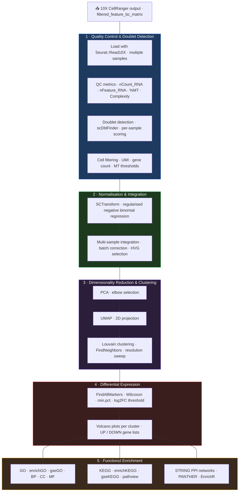

# snRNA-seq Analysis Pipeline

**Tech stack**: R · Seurat v5 · sctransform · scDblFinder · clusterProfiler · ComplexHeatmap · STRINGdb · rbioapi
**Repository**: [github.com/SLopezBegines/snRNAsep_mouse](https://github.com/SLopezBegines/snRNAsep_mouse)

## Overview

End-to-end modular R pipeline for single-nucleus RNA-seq analysis, built on Seurat v5 and designed for multi-sample WT vs KO experiments in mouse neural tissue. The pipeline processes 10X CellRanger output through every analytical stage — quality control, SCTransform normalisation, dimensionality reduction, clustering, differential expression, and six parallel enrichment methods — producing publication-ready figures and pathway reports.

Each stage is implemented as an independent script called via `source()` from RMarkdown notebooks. This architecture decouples analysis logic from execution, enabling rapid adaptation to new datasets and organisms without modifying the core pipeline.

## Problem & Approach

Single-nucleus RNA-seq datasets present three compounding analytical challenges addressed by this pipeline:

- **Doublet contamination** — scDblFinder independently scores each sample before integration, preventing artificial cluster formation from cell multiplets.
- **Multi-sample batch effects** — SCTransform (regularised negative binomial regression) normalises each sample separately; Seurat's integration workflow aligns latent spaces across replicates without removing biological variation.
- **Cluster-level interpretation** — differential expression runs per cluster (Wilcoxon), and results feed six parallel enrichment methods (GO ORA, GO GSEA, KEGG, STRING, PANTHER, EnrichR) to obtain convergent pathway evidence rather than relying on any single database.

## Analytical Workflow

## Key Technical Details

- 14 modular R scripts with single functional responsibility; sourced from RMarkdown notebooks
- SCTransform normalisation followed by Seurat CCA integration for multi-sample batch correction
- scDblFinder doublet detection run independently per sample before integration
- Louvain clustering explored across multiple PC levels and resolutions; optimal parameters selected by elbow plot and cluster stability
- Wilcoxon rank-sum test for differential expression per cluster; gene lists split UP/DOWN for directional enrichment
- Six parallel enrichment approaches: GO ORA, GO GSEA, KEGG ORA, KEGG GSEA, STRING PPI, PANTHER, EnrichR
- Allen Brain Atlas (`SingleR`, `Azimuth`) for reference-based cell type annotation
- Reproducible environment via `renv` lockfile (R 4.5.2)
- All figures exported in TIFF (publication raster) + PDF (vector) formats
